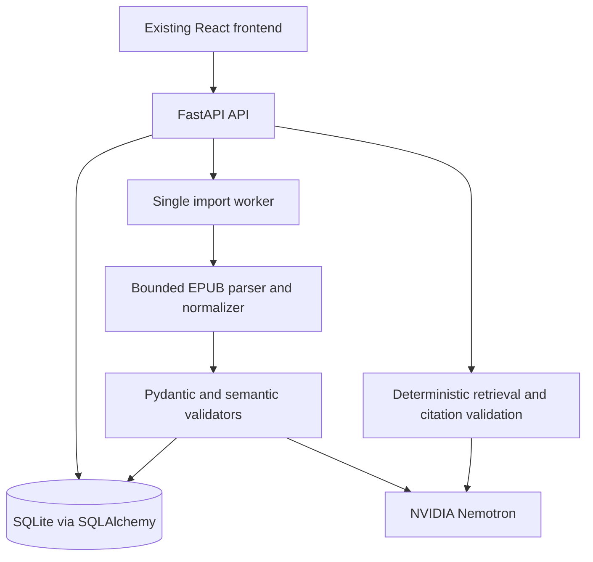

# System Architecture

## Status
This document defines the approved hackathon target. It does not describe the current implementation as complete.

## Current Repository State
- Lovable-generated React and TypeScript frontend.
- TanStack Start/Vite tooling.
- Existing Supabase authentication/data integrations.
- Existing PostgreSQL-oriented Drizzle configuration and migrations.

Those technologies remain in the repository during this documentation pass. Removing or migrating them is a later controlled implementation phase.

## Approved Hackathon Target
- Preserve the existing React/TypeScript frontend where practical.
- Add a Python FastAPI backend.
- Use SQLite locally through SQLAlchemy.
- Use Pydantic for strict contracts and validation.
- Parse EPUBs deterministically before AI processing.
- Send normalized text, never archive bytes, to server-side NVIDIA Nemotron.
- Store only validated academic records and evidence.
- Have the frontend communicate with FastAPI through documented HTTP contracts.

## Component Flow

## Trust Boundaries
The browser, EPUB archive, normalized source text, model response, and database are separate trust boundaries. The parser rejects unsafe archives. The model receives only bounded normalized text. The model cannot choose ownership, execute code, access tools, or write directly to the database.

## Import Lifecycle
`queued -> reading -> extracting -> validating -> completed` or `completed_with_warnings`; processing states can become `failed` or `interrupted`. Academic records are committed atomically after all chunks validate.

## Session Model
The target uses a private browser workspace with an opaque server-managed session cookie, ownership checks on every resource, CSRF protection for mutations, and a short expiration. This is a demo session model, not production identity management.

## Explicit Non-Goals
Azure, PostgreSQL migration, Docker, Kubernetes, Redis, Celery, microservices, LangChain, LangGraph, Supabase migration, vector databases, live Canvas API integration, and banking integrations are not MVP architecture requirements.
